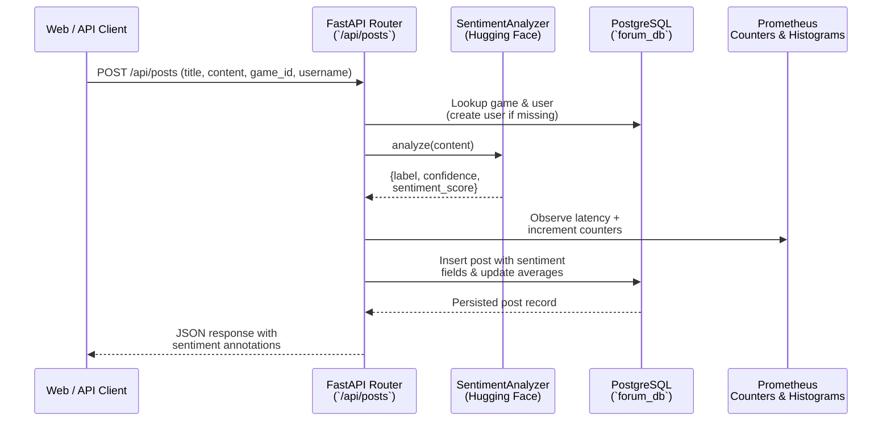

# Gaming Forum Sentiment Platform

Modern full-stack reference implementation that combines a FastAPI backend, React/Vite frontend, Azure-hosted PostgreSQL database, and Terraform-managed infrastructure to power a gaming community experience enriched with machine learning–driven sentiment insights.

## Highlights
- **Real-time sentiment analysis** for forum posts using a state-of-the-art Twitter RoBERTa transformer pipeline.
- **Cloud-native deployment** on Azure Container Apps with automated builds via CircleCI.
- **Infrastructure as Code** covering compute, networking, database, and monitoring stacks.
- **Observability** with Prometheus scraping and Grafana dashboards.

## Architecture Overview

| Layer | Technology | Notes |
|-------|------------|-------|
| Frontend | React 18 + Vite + TypeScript | SPA served from a container; pulls data from backend REST API. |
| Backend | FastAPI, SQLAlchemy, Pydantic | Exposes REST endpoints for games, posts, analytics, and Prometheus metrics. |
| Machine Learning | `cardiffnlp/twitter-roberta-base-sentiment-latest` via Hugging Face Transformers | Inference-only usage wrapped in a singleton `SentimentAnalyzer`. |
| Database | Azure PostgreSQL Flexible Server | Stores users, games, posts, and comments. Seed data available in `database/init.sql`. |
| Infrastructure | Terraform | Separate stacks for core resources (`terraform/`) and monitoring (`monitoring/`). |
| Observability | Prometheus, Grafana | Containerized stack deployable via Terraform, with dashboards in `dashboard/`. |
| CI/CD | CircleCI | Builds/pushes container images to Azure Container Registry and deploys to Container Apps. |

### Backend Service
- Located in `backend/`.
- FastAPI app defined in `backend/main.py` with lifespan hook that auto-creates database tables.
- SQLAlchemy models and Pydantic schemas under `backend/models.py` and `backend/schemas.py`.
- Metrics exported in Prometheus format (`/metrics`) using custom counters, gauges, and histograms defined in `backend/prometheus_metrics.py`.
- Sentiment analysis orchestrated in `backend/sentiment.py`, returning normalized label (`POSITIVE`, `NEGATIVE`, `NEUTRAL`), confidence, and signed score.

### Sentiment Workflow



### Frontend Application
- Codebase under `frontend/`. Vite configuration in `frontend/vite.config.ts`.
- Interfaces with backend using `frontend/src/api/client.ts` and renders data through React components such as `GamesList` and `Navbar`.
- Environment-specific API URL configured via build-time argument `VITE_API_URL`.

### Infrastructure & Monitoring
- Core Azure resources (resource group, Container Apps environment, ACR, PostgreSQL Flexible Server) expressed in `terraform/`.
- Monitoring stack (managed Prometheus, Grafana, alerts) defined in `monitoring/`.
- Re-usable templates for Prometheus and Grafana configuration live in `monitoring/config/`.
- Grafana dashboards can be imported from `dashboard/dashboard.json`.

## Machine Learning Model Details
- **Model**: `cardiffnlp/twitter-roberta-base-sentiment-latest`
- **Source**: Hugging Face Transformers Hub (downloaded at container build time).
- **Task**: Sentiment classification (positive, neutral, negative) on short-form gaming content.
- **Post-processing**:
  - Truncates user text to 512 characters to respect tokenizer limits.
  - Converts raw label to uppercase canonical form.
  - Uses model confidence as absolute value, sign-flipping for negative sentiment to produce a `sentiment_score` in `[-1, 1]`.
- **Performance considerations**:
  - Model is initialized once per container via singleton pattern to avoid repeated downloads.
  - CPU inference by default (`device=-1`); adjust to GPU by setting `device` if deploying on GPU-enabled nodes.

## Local Development

### Prerequisites
- Docker Desktop (or compatible runtime)
- Make sure ports `3000`, `8000`, and `5432` are available.
- Optional: Python 3.11+ and Node.js 18+ for running services without Docker.

### Quick Start with Docker Compose
```bash
docker compose up --build
```
This brings up:
1. PostgreSQL with seed schema/data via `database/init.sql`.
2. FastAPI backend on http://localhost:8000.
3. React frontend on http://localhost:3000.
4. Optional pgAdmin UI on http://localhost:5050 (credentials set in `docker-compose.yml`).


## Database Management
- Core schema defined via SQLAlchemy models (`backend/models.py`) and synchronized automatically when the backend starts.
- One-off initialization or reseeding can be performed with:
  ```bash
  psql -h <host> -U <user> -d forum_db -f database/init.sql
  ```
- Extended data generation utilities are in `backend/generate_sample_data.py` (creates 1000 sentiment-scored posts).


## Infrastructure as Code
- Initialize Terraform in each stack directory (`terraform/`, `monitoring/`).
  ```bash
  cd terraform
  terraform init
  terraform plan
  terraform apply
  ```
- Sensitive variables (`*.tfvars`) are ignored from version control. Copy `terraform/terraform.tfvars.example` (if created) or set values via CLI/remote state.
- Outputs include Azure Container Registry credentials, Container Apps environment ID, and PostgreSQL FQDN for downstream automation (CircleCI, Grafana, etc.).

## CI/CD Pipeline
- `.circleci/config.yml` orchestrates:
  1. Backend image build & push to ACR.
  2. Deployment to Azure Container Apps with environment variables (including `DATABASE_URL`).
  3. Frontend image build using live backend URL.
  4. Frontend deployment and summary output.
- The pipeline expects Azure service principal credentials and ACR secrets as environment variables in CircleCI.

## Observability
- Prometheus scrape config templated at `monitoring/config/prometheus.yml.tpl`.
- Grafana data sources and dashboards templated in `monitoring/config/grafana-datasources.yml.tpl` and `dashboard/dashboard.json`.

- Key metrics:
  - `sentiment_analysis_total` (counter per game and sentiment).
  - `posts_created_total`.
  - `game_sentiment_score` (gauge of rolling average sentiment).
  - `sentiment_analysis_duration_seconds` (histogram for inference latency).

## Deployment
> **TODO:** Add step-by-step instructions for provisioning, secrets management, and triggering production deployments.

Suggested outline to fill in:
1. Terraform apply (core + monitoring).
2. Configure CircleCI project variables.
3. Trigger `build-and-deploy` workflow on `main` branch.
4. Post-deploy verification: `/health`, `/metrics`, Grafana dashboard import.gi
---
